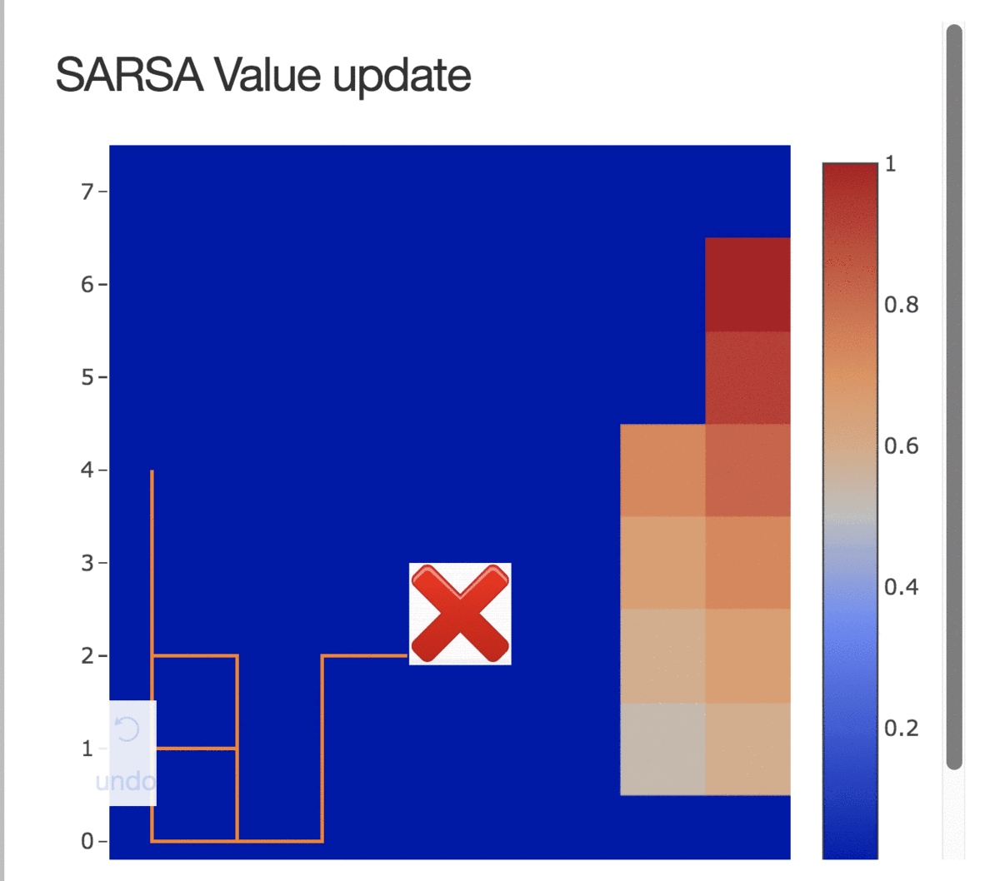

#GYMS from OpenAI

[Blog post about this repo](http://www.lessand.ro/8/post)

- [ ] FrozenLake

Trained two Time-Differences models using SARSA and Q-Learning on the FrozenLake OpenAI Gym `/FrozenLake/TDmodel.py`

Built a training visualization tool using [dash](https://plot.ly/products/dash/) embedded into jupyter lab.

Here is a sample from a training of a SARSA-based agent.

